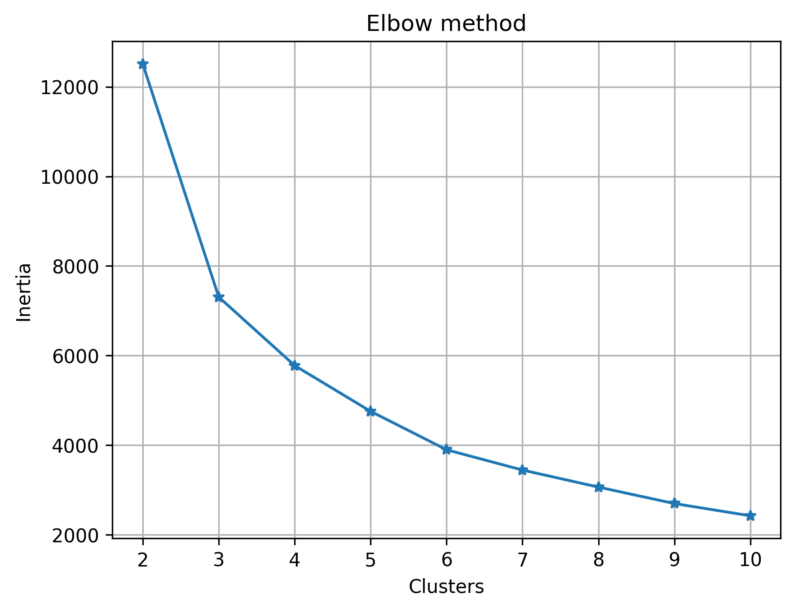
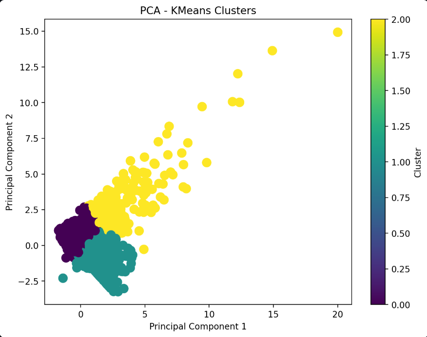
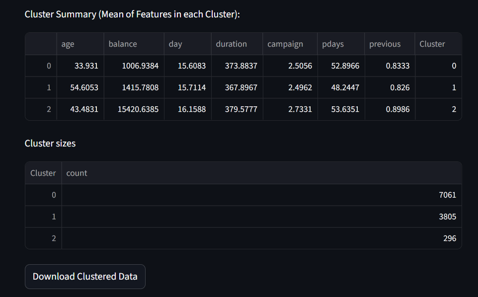

# Customer Segmentation Analysis


## Aim of the Project 

The aim of this project is to develop an **end-to-end machine learning pipeline** that performs customer segmentation.  
It combines **exploratory analysis** and a **Streamlit web application** to help organisations:  
- Understand customer patterns more effectively  
- Identify meaningful segments within their customer base  
- Enable smarter decision-making through data-driven insights  


## Who Benefits from This Project?  
This project is designed to benefit a wide range of stakeholders:  

- **Banks & FinTechs** → to segment customers for personalised financial products, credit risk analysis, and targeted marketing  
- **Retail & E-commerce Companies** → to identify loyal customers, bargain hunters, or high-value buyers  
- **Telecom Providers** → to classify users by data consumption and design customised bundles  
- **Healthcare & Insurance** → to group patients or policyholders for tailored plans and preventive care  
- **Researchers & Data Scientists** → as a practical template for clustering, feature selection, and model deployment with Streamlit  


## Project Overview
This project delivers an **end-to-end machine learning pipeline** for customer segmentation.  
It applies **K-Means clustering** to automatically group customers into meaningful segments, enabling businesses to better understand their customer base and make data-driven decisions.  


Unlike a standard analysis, this solution goes further by providing a **Streamlit web application** where users/banks can:  
- Upload their own dataset  
- Select numeric features for clustering  
- Automatically determine the optimal number of clusters (Elbow Method)  
- Visualise clusters in 2D with PCA  
- Explore cluster summaries and sizes  
- Download the enriched dataset with assigned cluster labels  

This makes it a **practical tool** for analysts, product managers, and financial institutions who want actionable insights.  


## Jupyter Notebook (Exploratory Analysis)  
Alongside the Streamlit app, this repository also includes a Jupyter Notebook that can be seen in the Notebook folder:  

- **Customer_Segmentation_Analysis.ipynb**  
  This notebook contains the step-by-step exploratory data analysis (EDA), preprocessing, and clustering workflow.  
  It demonstrates the process of feature selection, scaling, applying K-Means, evaluating with the Elbow Method, and visualising clusters.  

The notebook is useful for:  
- Understanding the logic behind the Streamlit app  
- Reproducing the clustering process manually  
- Experimenting with different datasets or features before deploying  


## Business Context  
Customer segmentation is a cornerstone of modern business strategy. With better segmentation, organisations can:  
- Tailor products and services to specific groups  
- Improve targeting in marketing campaigns  
- Identify high-value vs low-engagement customers  
- Enhance customer retention and loyalty programs  
- Support smarter decision-making in credit risk and product development  

While this project was designed with financial services in mind, the framework is **industry-agnostic** and can be applied in retail, telecom, healthcare, education, and more.  


## Features of the App  

-  Upload CSV datasets  
-  Select numeric features for clustering  
-  Determine optimal clusters using the Elbow Method  
-  Apply K-Means clustering with validation (Silhouette Score)  
-  Visualise clusters with PCA scatterplots  
-  View cluster-level summaries & counts  
-  Download enriched dataset with cluster labels  

---

## Installation and Usage


### 1. Clone the Repository

```bash
git clone https://github.com/NStanley0524/Customer_Segmentation_Analysis_Python.git
cd Customer_Segmentation_Analysis_Python
```


### 2. Install Dependencies

```bash
pip install -r requirements.txt
```

### 3. Run the Streamlit app

```bash
streamlit run app.py
```


## Example Outputs

1.  Elbow Method




The Elbow Method plot shows the relationship between the number of clusters (k) and the inertia (within-cluster variance).  

**What it means:**  
- The plot bends at around **k = 3**, suggesting that three clusters provide a good balance between simplicity and accuracy.  
- Adding more clusters beyond this point reduces inertia only marginally, meaning it doesn’t add significant explanatory power.  

**Business insight:**  
Selecting **3 clusters** is optimal here — enough to capture meaningful customer diversity without overcomplicating the segmentation.  
This makes it easier for business teams to design and manage targeted strategies for each group. 


2. PCA-KMeans Clusters




This scatterplot shows the customer clusters after applying **Principal Component Analysis (PCA)** for dimensionality reduction.  
Each dot represents a customer, positioned based on their underlying features, and coloured according to the cluster they belong to.  

**What it means:**  
- The separation of colours demonstrates that customers can indeed be grouped into **distinct segments**.  
- Some clusters are denser, representing larger groups of customers with similar behaviour.  
- Outliers can be spotted at the edges, suggesting unusual customer profiles.  

**Business insight:**  
These clusters may represent different financial behaviours (e.g., conservative, moderate, and high-value customers). Understanding their differences helps tailor products and marketing strategies.


3. Cluster Summary




This table shows the **average values of features** in each cluster, alongside the **cluster sizes** (number of customers per group).  

**What it means:**  
- The summary gives a high-level view of the defining characteristics of each cluster.  
- Cluster 0 is the largest group, indicating the most common customer profile.  
- Cluster 1 is moderate in size, while 
- Cluster 2 is the smallest...representing a niche but possibly high-value segment.  

**Business insight:**  
- Large clusters may need broad, cost-effective engagement strategies.  
- Smaller clusters could warrant **specialised attention**, especially if they show higher balances or unique behaviours.  
- These insights guide resource allocation for targeted campaigns.  


## Example Cluster Personas

To make results more interpretable, clusters can be seen as:

Cluster 0: Budget-conscious customers with lower engagement

Cluster 1: Mid-level customers with steady engagement

Cluster 2: High-value customers with premium needs

*(These personas are illustrative — actual insights depend on the dataset and selected features.)*


## Tech Stack

1. Python: Pandas, NumPy, Scikit-learn, Matplotlib, Seaborn

2. Streamlit: Interactive web deployment

3. Jupyter Notebook: Exploratory analysis


